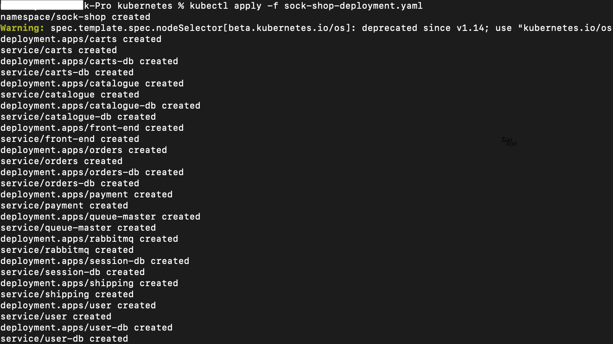
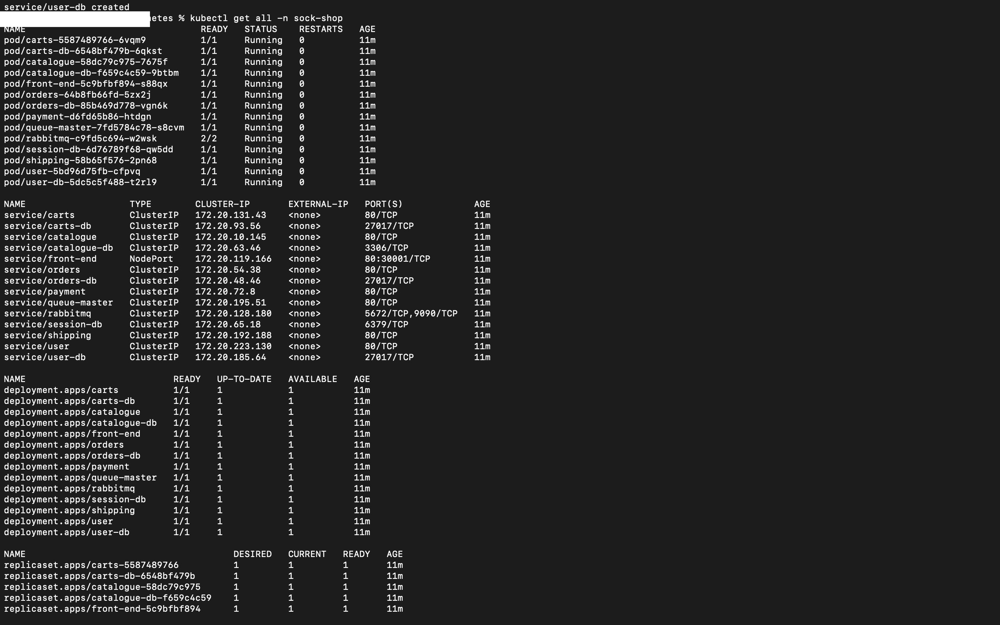
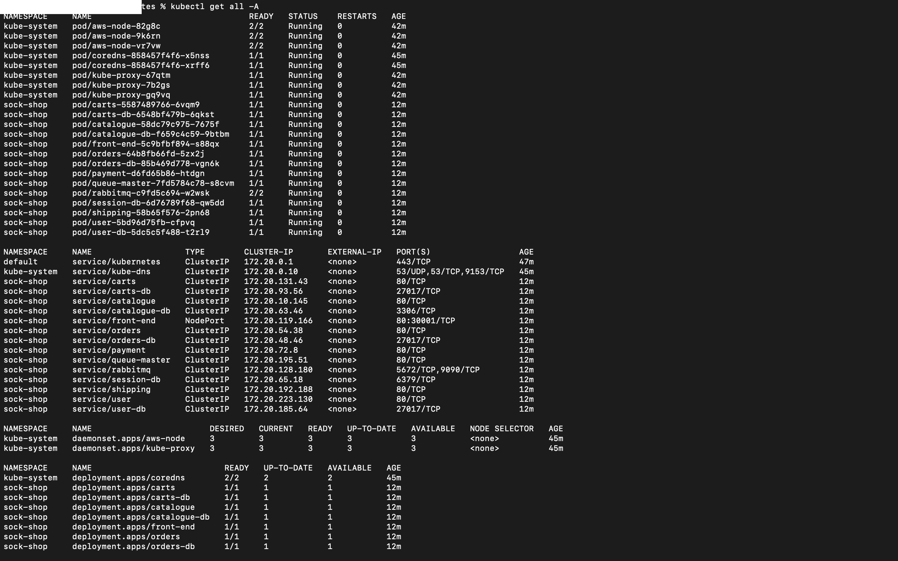
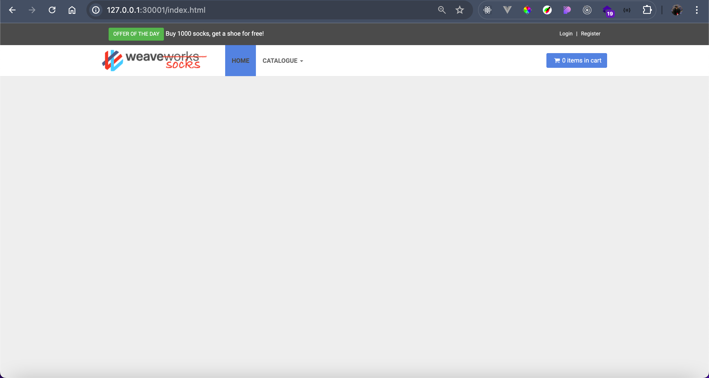

# **Socks Shop Microservices-based Application Deployment on Kubernetes using IaC.**

## **Project Overview:**

Objective: Deploy the Socks Shop application, a microservices-based architecture, on Kubernetes using Infrastructure as Code (IaC). The goal is to automate and streamline the deployment process, ensuring clarity, maintainability, and security.

## **Setup Details:**

Provision the Socks Shop example microservice application from the following repositories:

- [Socks Shop Microservices Demo GitHub Repository](https://github.com/microservices-demo/microservices-demo.github.io)
- [Detailed Implementation Guide GitHub Repository](https://github.com/microservices-demo/microservices-demo/tree/master)

## **Task Instructions:**

All deliverables must be deployed using an Infrastructure as Code approach.
Emphasize readability and maintainability in your application deployment.
Provide a clear way to recreate your setup, with evaluations based on:

- Deploy pipeline
- Metrics (Alertmanager)
- Monitoring (Grafana)
- Logging (Prometheus)
- Use Prometheus for monitoring.
- Use Ansible or Terraform for configuration management.
- Deploy on a Kubernetes cluster using an IaaS provider of your choice.
- Ensure the application runs on HTTPS with a Let’s Encrypt certificate.

## **Bonus Points:**

- Secure the infrastructure with network perimeter security access rules.
- Use Ansible Vault to encrypt sensitive information.

## **Project Deliverables:**

- Terraform Configuration: For provisioning the infrastructure on AWS, including VPCs, subnets, security groups, and EKS cluster.
- Deployment Pipeline Configuration: Using GitHub Actions.
- Kubernetes Manifests: For deploying the Socks Shop application.
- Prometheus Configuration: For monitoring the application.
- ELK Stack Configuration: For centralized logging.
- Ansible Playbooks: For securing the infrastructure.
- Documentation: Detailed instructions on how to run the project.

## **Project Structure:**

```
microservices-demo.github.io/
├── .github/
│   └── workflows/
│       └── deploy.yaml    # GitHub Actions workflow for CI/CD automation.
├── kubernetes/
│   ├── sock-shop-deployment.yaml   # Kubernetes deployment manifests
│   └── sock-shop-ingress.yaml      # Kubernetes ingress manifest
├── manifests-monitoring/
│   ├── prometheus/
│   │   └── values.yaml   # Custom values for Prometheus Helm chart
│   └── grafana/
│       └── values.yaml   # Custom values for Grafana Helm chart
├── logging/
│       ├── elasticsearch.yaml  # Elasticsearch deployment
│       ├── filebeat.yaml       # Fluentd configuration
│       └── kibana-deployment.yaml   # Kibana dashboard configuration
|       └── cronjob.yaml        # Fluentd configuration
|       └── metricbeat.yaml     #  Fluentd configuration
|       └── logstash-deployment.yaml   # Fluentd configuration
├── terraform/
│   ├── main.tf         # Main Terraform configuration for AWS EKS
│   ├── terraform.tf    # Terraform configuration
│   ├── outputs.tf      # Terraform outputs
│   └── variables.tf          # Variables configuration
└──README.md
```

1. Install Prerequisites:

   - [AWS CLI](https://aws.amazon.com/cli/)
   - [Terraform](https://www.terraform.io/downloads.html)

2. Setup Terraform Configuration:

## Create a directory for the Terraform configuration files

```
mkdir socks-shop-deploy
```

```
cd socks-shop-deploy
```

## Clone the repository

```
git clone https://github.com/microservices-demo/microservices-demo.github.io.git
```

```
cd microservices-demo.github.io/deploy/terraform
```

## Initialize the Terraform project

```
terraform init
```

## Create an execution plan

```
terraform plan
```

## Apply the changes

```
terraform apply --auto-approve
```

Below is a screenshot of my EKS cluster being provisioned by terraform👇🏽:


2. Configure AWS CLI and kubectl:

## Run the command below and Follow the instructions to store credentials of your IAM user on your local environment and Update your Kubectl Config

```
aws configure
aws eks update-kubeconfig --name=socks-shop-cluster --region=us-east-2
```

## Apply the deployment manifests to the cluster

```
cd microservices-demo.github.io/deploy/kubernetes
```

```
kubectl apply -f sock-shop-deployment.yaml

```



## You can now use the kubeconfig file to access the Kubernetes cluster and deploy the Socks Shop application.

```
kubectl get all -n sock-shop
```



## You can also use the following command to verify that the Socks Shop application is running on the Kubernetes cluster:

```
kubectl get all -A
```



## After we confirm that our pods are running, we can now test the application by port-forwarding the service to our local machine using the following command:

```
kubectl port-forward service/front-end -n sock-shop 30001:80
```



2. To Deploy Globally with security (Https):

## **install Nginx Ingress controller to so you can be able to get External Ip**

```
kubectl apply -f https://raw.githubusercontent.com/kubernetes/ingress-nginx/main/deploy/static/provider/cloud/deploy.yaml

```

## **you might modify your front-end service to use type: LoadBalancer**

```
kubectl apply -f global-service.yaml
```

## **Install cert-manager CRDs**

```
kubectl apply -f https://github.com/cert-manager/cert-manager/releases/download/v1.11.1/cert-manager.crds.yaml
```

## **Install cert-manager**

```
kubectl apply -f https://github.com/cert-manager/cert-manager/releases/download/v1.11.1/cert-manager.yaml
```

## **Or using Helm**

```
helm repo add jetstack https://charts.jetstack.io
helm repo update
helm install cert-manager jetstack/cert-manager --namespace cert-manager --create-namespace --version v1.11.1 --set installCRDs=true
```

## **Verify installation**

```
kubectl get pods --namespace cert-manager
```

## **Apply the ClusterIssuer**

```
kubectl apply -f clusterissuer.yaml
```

## **Get front-end service external ip**

```
kubectl get service front-end -n sock-shop
```

## **Deployment Pipeline:**

Create a `.github/workflows/deploy.yaml` file:
navigate to github console and Store AWS_ACCESS_KEY_ID and AWS_SECRET_ACCESS_KEY credentials on github as a secrete variable.

name: Deploy Sock Shop Application

on:
push:
branches: - master

jobs:
terraform:
name: Terraform
runs-on: ubuntu-latest

    steps:
      - name: Checkout
        uses: actions/checkout@v3

      - name: Configure AWS Credentials
        uses: aws-actions/configure-aws-credentials@v4
        with:
          aws-access-key-id: ${{ secrets.AWS_ACCESS_KEY_ID }}
          aws-secret-access-key: ${{ secrets.AWS_SECRET_ACCESS_KEY }}
          aws-region: us-east-2

      - name: Login to Amazon ECR
        id: login-ecr
        uses: aws-actions/amazon-ecr-login@v1

      - name: install kubectl
        run: |
          sudo curl -LO "https://dl.k8s.io/release/$(curl -L -s https://dl.k8s.io/release/stable.txt)/bin/linux/amd64/kubectl"
          sudo install -o root -g root -m 0755 kubectl /usr/local/bin/kubectl

      # install terraform
      - name: install terraform cli
        uses: hashicorp/setup-terraform@v3

      - name: Terraform Init
        working-directory: ./deploy/terraform
        run: terraform init

      - name: Terraform Plan
        id: plan
        working-directory: ./deploy/terraform
        run: terraform plan

      # tf apply and deploy to EKS
      - name: Terraform apply
        id: apply
        working-directory: ./deploy/terraform
        run: terraform apply --auto-approve

      - name: AWS EKS with Kubectl
        uses: giovannirossini/aws-eks@v1.0.1
        with:
          aws-access-key-id: ${{ secrets.AWS_ACCESS_KEY_ID }}
          aws-secret-access-key: ${{ secrets.AWS_SECRET_ACCESS_KEY }}
          aws-region: 'us-east-2'
          cluster-name: 'socks-shop-cluster'
          command: |
            kubectl apply -f ./deploy/kubernetes/sock-shop-deployment.yaml

## **Monitoring:**

## Prometheus:

1. Create Monitoring Namespace:

```
   cd ../manifests-monitoring/prometheus
   kubectl create -f 00-monitoring-ns.yaml
```

2. Deploy Prometheus:

```
   kubectl apply $(ls _-prometheus-_.yaml | awk ' { print " -f " $1 } ')
```

## Expose Prometheus server

```
kubectl port-forward service/prometheus 31090:9090 -n monitoring
```

## Grafana:

1. Deploy Grafana:

```
kubectl apply $(ls _-grafana-_.yaml | awk ' { print " -f " $1 }' | grep -v grafana-import)
```

## Once Grafana pod is running, import dashboards

```
kubectl apply -f 23-grafana-import-dash-batch.yaml
```

## Expose Grafana server

```
kubectl port-forward service/grafana 31300:3000 -n monitoring
```

## Logging:

1. Deploy ELK Stack:

```
   cd ../logging
   kubectl apply -f .
```

## Verify the logging services

```
kubectl get all -n kube-system
```

## Port forward Kibana service

```
kubectl port-forward service/kibana 5601:5601 -n kube-system
```

## **Security:**

- Implement HTTPS using Let's Encrypt certificates.
- Configure network perimeter security access rules.
- Use Ansible Vault to encrypt sensitive information.

## **Conclusion:**

This project provides hands-on experience with Infrastructure as Code, Kubernetes, DevOps best practices, and cloud security. By the end of the project, you will have a fully functional deployment pipeline for the Socks Shop application, including infrastructure provisioning, monitoring, logging, and security.

## **References:**

- [Terraform Documentation](https://www.terraform.io/docs/index.html)
- [AWS Documentation](https://docs.aws.amazon.com/index.html)
- [Kubernetes Documentation](https://kubernetes.io/docs/home/)
- [Prometheus Documentation](https://prometheus.io/docs/)
- [ELK Stack Documentation](https://www.elastic.co/guide/index.html)
- [Ansible Documentation](https://docs.ansible.com/ansible/latest/index.html)
- [Let's Encrypt Documentation](https://letsencrypt.org/docs/)
- [Docker Documentation](https://docs.docker.com/)
- [Socks Shop Application](https://github.com/microservices-demo/microservices-demo.github.io)
- [GitHub Actions Documentation](https://docs.github.com/en/actions)
